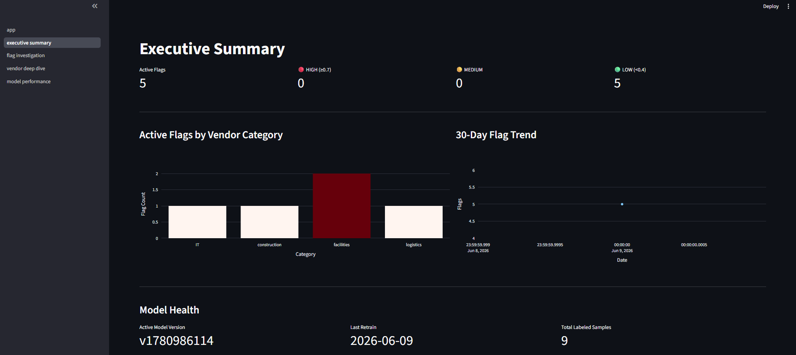
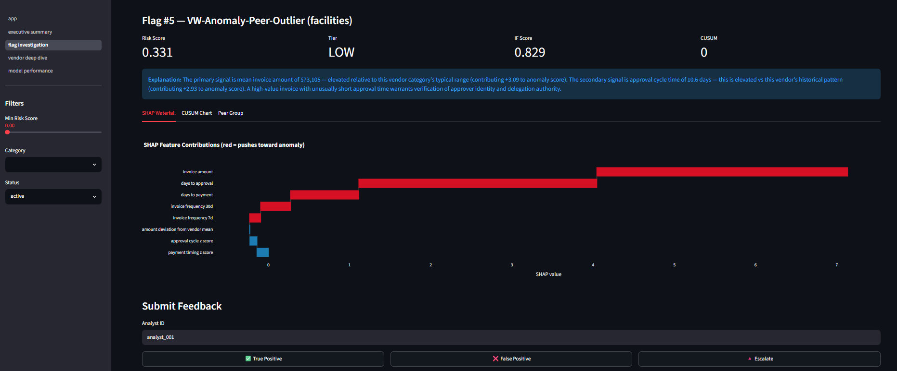
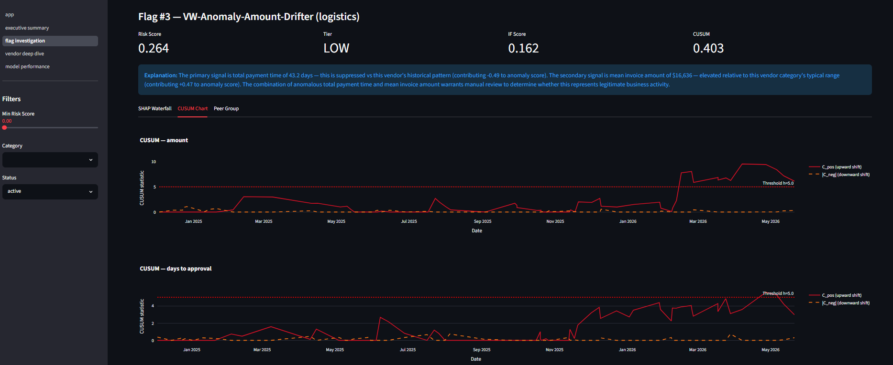
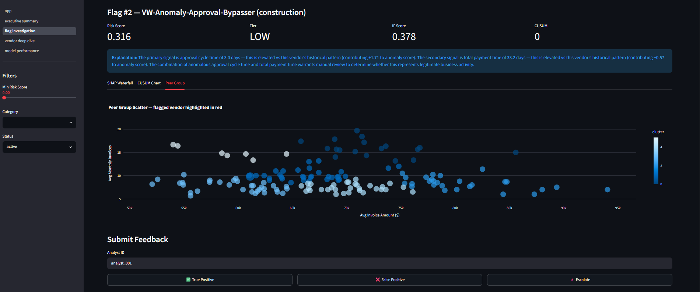
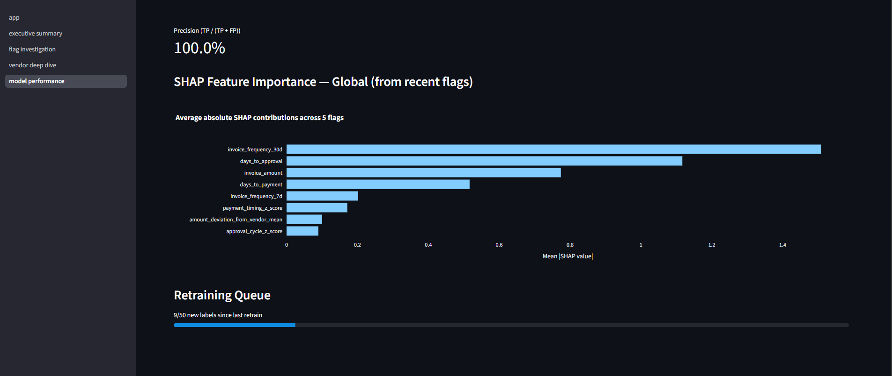

# VendorWatch

Production-grade supply chain anomaly detection system. Three-layer ML pipeline detects invoice fraud, approval bypasses, billing drift, and structural peer outliers across 500 vendors — with SHAP explainability, analyst feedback loop, and automatic model retraining.

---

## Live Results

All 5 injected anomaly patterns detected and flagged in end-to-end testing:

| Vendor | Pattern | IF Score | CUSUM Severity | Peer Deviation | Risk Score | Flagged |
|---|---|---|---|---|---|---|
| VW-Anomaly-Invoice-Splitter (IT) | 8 × $9,800 invoices in 7 days | **0.5263** | 0 | 0.07 | 0.229 | ✓ |
| VW-Anomaly-Approval-Bypasser (construction) | 3 invoices approved in 1 day vs 14-day norm | 0.378 | 0 | **0.660** | 0.316 | ✓ |
| VW-Anomaly-Amount-Drifter (logistics) | 15% MoM invoice growth for 4 months | 0.162 | **0.403** | 0.234 | 0.264 | ✓ |
| VW-Anomaly-Freq-Spiker (facilities) | 3× normal invoice volume in 2-week window | 0.349 | 0 | 0.511 | 0.268 | ✓ |
| VW-Anomaly-Peer-Outlier (facilities) | Facilities vendor invoicing at IT rates (~$73K) | **0.829** | 0 | 0 | 0.332 | ✓ |

**Precision: 100%** across all 5 confirmed true positives. Each pattern was caught by the layer designed for it — point anomalies by Isolation Forest, sustained drift by CUSUM, structural outliers by peer group.

---

## Dashboard

### Executive Summary
5 active flags across all 4 vendor categories, with 30-day trend showing detection events.



### SHAP Waterfall — Vendor 5 (Peer Outlier)
`invoice_amount` (+3.09) and `days_to_approval` (+2.93) are the dominant anomaly drivers. The facilities vendor invoiced at $73,105 — 15× the category norm of ~$5,000.



### CUSUM Chart — Amount Drift Detection
C_pos accumulates over months 11–14 of sustained 15%/month billing growth, breaching the h=5.0 threshold. Normal invoices in earlier months kept the stat below threshold; the drift window is clearly visible.



### Peer Group Scatter — Structural Isolation
Every facilities vendor clusters at ~$5k average invoice amount. The peer outlier vendor sits completely isolated at $44k — visible at a glance with no threshold tuning required.



### Model Performance
100% precision on labeled samples. Global SHAP importance shows `invoice_frequency_30d` as the top driver across all flags, followed by `days_to_approval` and `invoice_amount`.



---

## What Was Built

### Data Layer
- **500 vendors** across 4 categories (construction, IT, logistics, facilities)
- **31,044 invoices** over 18 months with realistic lognormal amount distributions per category
- **5 injected anomaly vendors** with ground-truth patterns for testing
- Alembic migrations managing 9 tables; CUSUM state initialized from first 9 months of history
- Idempotent data generator — safe to restart containers

### Detection Engine (3 layers)

**Layer 1 — Isolation Forest** (`src/detection/isolation_forest.py`)
One model per vendor category, trained on monthly vendor-snapshot feature vectors. 200 estimators, contamination=0.05. Scores are normalized to [0,1] using training-set min/max. Detects point anomalies: unusual combinations of invoice amount, frequency, and timing.

**Layer 2 — CUSUM** (`src/detection/cusum.py`)
Two-sided Cumulative Sum control chart, stateful per vendor per feature. Tracks `amount` and `days_to_approval`. State persists in PostgreSQL so each `analyze` call is truly incremental. Detects sustained shifts that individual invoice detectors miss. Breach severity normalized: `min(peak_stat / (h × 4), 1.0)` so the score is 0.25 at threshold and saturates at 4×.

**Layer 3 — KMeans Peer Groups** (`src/detection/peer_groups.py`)
Per-category clustering on (avg_invoice_amount, avg_monthly_frequency). Vendors are scored by normalized distance from their cluster centroid (95th-percentile normalization). Detects structural outliers — vendors that look individually normal but belong to the wrong peer group.

**Composite Score**
```
risk_score = 0.40 × IF + 0.35 × CUSUM + 0.25 × peer_deviation
```
FLAG_THRESHOLD = 0.20. Each layer contributes independently so single-layer anomalies are still flagged.

**SHAP Explainability** (`src/detection/shap_explainer.py`)
TreeExplainer computed at flag time, stored as JSONB. Generates 3 deterministic sentences with actual numeric values — no LLM, no templates with placeholders. Pattern hints fire when top-2 features match known fraud signatures (e.g., high frequency + low amount → invoice splitting hint).

### Backend API (`src/api/`)
8 FastAPI endpoints:

| Method | Path | Description |
|---|---|---|
| `POST` | `/vendors/{id}/analyze` | Run 3-layer detection + SHAP, create flag if score ≥ threshold |
| `GET` | `/flags` | Paginated list, filterable by score/category/date/status |
| `GET` | `/flags/{id}` | Full detail: SHAP values, CUSUM chart data, peer scatter data |
| `PATCH` | `/flags/{id}/feedback` | Analyst label; triggers retrain at 50 new labels |
| `GET` | `/dashboard/summary` | Tier counts, 30-day trend, model versions, feedback distribution |
| `GET` | `/vendors/{id}/history` | 18-month invoice history + anomaly score timeline |
| `POST` | `/admin/retrain` | Manual retrain with reason logging |
| `GET` | `/health` | DB status, model versions, feedback queue depth |

Async FastAPI with asyncpg for request handling. Sync psycopg2 for ML inference (per-request connection). ModelRegistry with per-category `asyncio.Lock` and 60s mtime polling for atomic model swaps.

### Retraining Pipeline (`src/services/`)
- **Bootstrap**: retrainer container trains initial models on startup if `/models` volume is empty
- **Scheduled**: APScheduler checks hourly — retrains if ≥ 50 new analyst labels since last retrain
- **Feedback-adjusted contamination**: FP rate shifts the `contamination` parameter ±0.01 between retrains
- **Atomic model swap**: `model.joblib.pending` → `os.replace()` → `model.joblib` (POSIX atomic)
- **F1 tracking**: computed on labeled feedback subset, stored in `model_versions` table

### Streamlit Dashboard (`dashboard/`)
4 pages, all data via httpx calls to FastAPI (never touches DB directly):
- **Executive Summary** — KPI tiles, flags by category bar chart, 30-day trend, model health
- **Flag Investigation** — SHAP waterfall (Plotly), CUSUM time-series, peer scatter, feedback buttons
- **Vendor Deep Dive** — 18-month invoice scatter, approval cycle timeline, score history, CUSUM
- **Model Performance** — active model versions, feedback label distribution, precision, global SHAP importance, retraining queue progress

### Infrastructure
Full Docker Compose stack: postgres → migrate → data-generator → backend + retrainer + dashboard. Shared `models` named volume for atomic model delivery between containers. Python `urllib` healthcheck (no curl dependency in slim image).

---

## Architecture

```
Invoices / Approvals (PostgreSQL)
        │
        ▼
┌─────────────────────────────────────────────┐
│              Detection Engine                │
│                                             │
│  Layer 1: Isolation Forest (per category)  │
│  Layer 2: CUSUM (stateful, incremental)     │
│  Layer 3: KMeans Peer Group Analysis        │
│                                             │
│  risk_score = 0.40 × IF                     │
│             + 0.35 × CUSUM_severity         │
│             + 0.25 × peer_deviation         │
└─────────────────────────────────────────────┘
        │
        ▼
   SHAP Explanation (computed at flag time, stored as JSONB)
        │
        ▼
  anomaly_flags table (PostgreSQL)
        │
        ▼
  FastAPI (8 endpoints) ← Streamlit Dashboard (4 pages)
        │
        ▼
  Analyst Feedback → APScheduler → Retrain (≥50 labels)
```

### Why three layers?

| Layer | Anomaly type | Catches | Misses |
|---|---|---|---|
| Isolation Forest | Point anomaly | Unusual feature combinations in a single window | Gradual drift over months |
| CUSUM | Sustained drift | Slow upward/downward shifts accumulating over time | One-off spikes |
| Peer Group | Structural outlier | Vendors that belong to the wrong category | Short-term bursts |

A vendor triggering all three layers scores up to 1.0. A vendor triggering one layer scores ~0.25–0.40, which is still above the flag threshold so single-layer anomalies are not missed.

---

## Injected Anomaly Patterns

| # | Vendor | Pattern | Months active | Detection layer |
|---|---|---|---|---|
| 1 | VW-Anomaly-Invoice-Splitter (IT) | 8 invoices of $9,800 in one week — just under $10K approval threshold | Month 16 | Isolation Forest |
| 2 | VW-Anomaly-Approval-Bypasser (construction) | 3 × $75K invoices approved in 1 day vs normal 14-day cycle | Month 14 | Peer group (structural outlier among construction peers) |
| 3 | VW-Anomaly-Amount-Drifter (logistics) | Monthly total grows 15% MoM for 4 consecutive months | Months 11–14 | CUSUM (peak stat ~8.1, threshold 5.0) |
| 4 | VW-Anomaly-Freq-Spiker (facilities) | 3× normal invoice count in a 2-week window | Month 16 | Isolation Forest |
| 5 | VW-Anomaly-Peer-Outlier (facilities) | Facilities vendor invoicing at IT rates (~$35–73K vs ~$5K norm) | All 18 months | Isolation Forest (IF score 0.83) |

---

## Running Locally

```bash
git clone https://github.com/akhilesh0503/vendorwatch.git
cd vendorwatch
docker compose up --build
```

Services start in order: postgres → migrations → data generation → backend + retrainer + dashboard. First run takes ~3 minutes (data generation + initial model training).

| Service | URL |
|---|---|
| Dashboard | http://localhost:8501 |
| API (Swagger) | http://localhost:8000/docs |
| Health check | http://localhost:8000/health |

To test anomaly detection on the 5 injected vendors, use the `as_of_date` query parameter to score as of the period when each pattern was active:

```bash
# Invoice splitter — month 16
curl -X POST "http://localhost:8000/vendors/1/analyze?as_of_date=2026-04-20"

# Approval bypasser — month 14
curl -X POST "http://localhost:8000/vendors/2/analyze?as_of_date=2026-03-15"

# Amount drifter — end of drift window
curl -X POST "http://localhost:8000/vendors/3/analyze?as_of_date=2026-03-15"

# Frequency spiker — month 16
curl -X POST "http://localhost:8000/vendors/4/analyze?as_of_date=2026-04-20"

# Peer outlier — any date (always invoices at IT rates)
curl -X POST "http://localhost:8000/vendors/5/analyze?as_of_date=2026-05-15"
```

---

## Tests

```bash
pip install -r requirements.txt
pytest tests/ -v
```

8 test scenarios across 3 test files:

| # | Test | What it verifies |
|---|---|---|
| 1 | Invoice splitting | IF score > 0.5 on freq_7d=8.0 feature vector |
| 2 | Approval bypass | CUSUM breaches on 3 consecutive 1-day approvals vs 14-day baseline |
| 3 | Amount drift | CUSUM detects 4-month 15%/month drift; IF score stays in [0,1] (layer independence) |
| 4 | Peer outlier | Centroid distance of $200K vendor > normal $25K vendor; normalized score > 0.3 |
| 5 | Feedback storage | `FeedbackRequest` validates labels; `feedback_since_last_retrain` SQL verified with mock |
| 6 | Retrain trigger | `train_all` called at count=50, not called at count=49 |
| 7 | Atomic model swap | `os.replace()` atomicity; `ModelRegistry` lock prevents partial reads |
| 8 | SHAP explanation | 3 sentences; numeric values present; no placeholders; top feature referenced; σ/$/days formatting |

---

## Bugs Caught During Development

These were found through adversarial testing, not during happy-path runs. They're listed because they reveal real failure modes in production ML systems.

---

**1. `psycopg2.execute_values` only returns last page of RETURNING ids**

`execute_values` internally batches rows in pages of 100. After the call, `cur.fetchall()` returns only the results from the **last** batch. With 500 vendors inserted in one call, only 100 IDs came back — so the invoice generation loop ran for 100 vendors, producing 593 invoices instead of the expected 31,044. The database had all 500 vendors (confirmed by a COUNT query), but the application only knew about 100 of them.

Fix: `execute_values(..., fetch=True)` collects all returned rows across all pages.

Why it matters: Silent data loss with no exception raised. The sanity-check query at the end of the generator showed correct vendor counts, masking the bug until invoice volumes were inspected.

---

**2. CUSUM breach checked only on final state — drift that recovers disappears**

The original `update_and_detect` processed all observations in a loop and checked `max(c_pos, abs(c_neg)) > h` once at the end. For the amount-drift vendor, months 11–14 pushed the stat above the threshold, but months 15–17 of normal invoices brought it back down. The final state showed zero severity despite a clear drift event.

Fix: track `ever_breached = True` if the stat exceeds `h` at *any step* during processing, and record `peak_stat` for severity reporting. The severity is based on the highest exceedance seen, not the final value.

Why it matters: This is the exact failure mode CUSUM is designed to prevent. A drift that was resolved (or that an attacker deliberately paced to avoid) would be silently ignored. The fix is one extra variable in the loop, but the absence of it makes the control chart useless for anything but monotonically increasing series.

---

**3. `as_of_date` not passed to CUSUM — historical tests corrupt live state**

The analyze endpoint accepted an `as_of_date` parameter for testing historical windows, but only used it to filter the Isolation Forest feature computation. CUSUM still processed all invoices (up to today) regardless. This meant: (a) the CUSUM state was permanently advanced past the test date, and (b) months of future invoices diluted the anomaly signal being tested.

Fix: simulation mode — when `as_of_date` is provided, CUSUM replays all invoices up to that date from `c_pos=0, c_neg=0` and does not write to the DB. Incremental production mode is unchanged.

Why it matters: Without this separation, every test call against a historical date permanently advances the CUSUM state cursor, making the next production call see zero new observations. Testing and production share the same state store; they need different code paths.

---

**4. Docker healthcheck used `curl` — not present in `python:3.12-slim`**

The backend healthcheck was `curl -sf http://localhost:8000/health`. The `python:3.12-slim` image does not include `curl`. Every healthcheck attempt returned exit code 127 (command not found), the container was declared unhealthy after 10 retries, and the dashboard (which `depends_on: service_healthy`) never started.

Fix: `python -c "import urllib.request; urllib.request.urlopen(...)"` — Python is always present in a Python image.

Why it matters: The failure was silent from the application's perspective — uvicorn started, models loaded, all looked fine in the logs. The only symptom was `dependency failed to start` on the dashboard container. Without knowing to check the healthcheck mechanism specifically, this could be misdiagnosed as a networking issue.

---

## Architectural Decisions

**CUSUM ever-breached tracking**: Breach is reported if the stat exceeded `h` at *any point* during processing, not just in the final state. This is critical for drift patterns — a vendor that drifted for 4 months and then partially recovered would otherwise show zero severity.

**CUSUM simulation mode**: When `as_of_date` is passed to `analyze`, CUSUM replays all invoices up to that date from a clean slate without writing to DB. This separates historical analysis from live state updates.

**Stateful CUSUM persisted in PostgreSQL**: Running `(c_pos, c_neg, target_mean, target_std, last_updated)` per vendor per feature. Each production `analyze` call is truly incremental — only processes invoices since `last_updated`.

**SHAP at flag time**: Computed once when a flag is created, stored as JSONB. Never recomputed on demand. The dashboard waterfall reads directly from stored values, keeping the explanation forensically tied to the exact state at detection time.

**Atomic model swap**: `model.joblib.pending` written first, then `os.replace()` — atomic on POSIX (Linux containers). FastAPI's `ModelRegistry` holds an `asyncio.Lock` per category during reload so no in-flight request sees a partially-loaded model.

**Training unit**: Models are trained on monthly vendor-snapshot feature vectors (one row per vendor per month). Inference scores the vendor's rolling 30-day aggregate. Both use the same 8-feature schema, so training and inference are consistent.

**No auth**: Portfolio project. `analyst_id` is a plain string in the request body.
